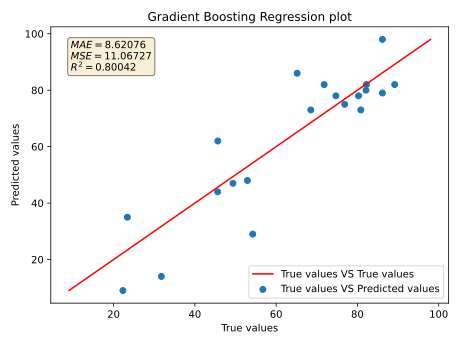
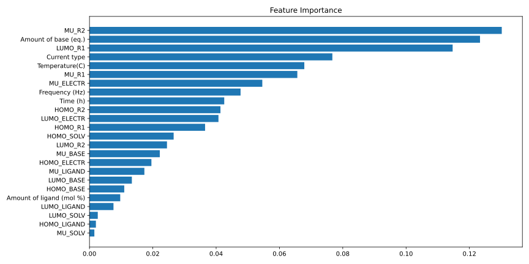

# Electrochemical reaction yield prediction

### Introduction

Electrochemical reaction yield depends on many parameters: the substrates nature, the catalyst, temperature, parameters and current type. It is difficult to assess how these parameters together will affect the reaction yield.

This project uses machine learning methods, experimental electrocatalysis data and DFT calculated data (homo energy, lumo energy, dipole moment) to predict NMR yield using regression models based on Scikit-learn.

### Data
[Experimental](https://docs.google.com/spreadsheets/d/102rQc17_JHDoWretecxRGFSqIWObgM_O/edit?usp=drive_link&ouid=114341486537402619521&rtpof=true&sd=true), [calculated](https://drive.google.com/file/d/1vBRLMoZ0BJfSmIDkLjB2MJrUmbZbyDdN/view?usp=drive_link) and [processed](https://drive.google.com/file/d/1E1TqQ82Ya_JsyzRDfFZZw601H4x1YKhx/view?usp=drive_link) data are presented.

### Installation
You can use the pip package manager to install dependencies:
```bash
pip install -r requirements.txt
```

### Notebooks
The `notebook` folder contains Jupyter notebooks for training and predict models.

### Models Evaluation
The evaluation results of models are presented in `report` folder. The GradientBoostingRegressor model has the best result.

<p align="center">
  
</p>


Feature Importance calculate a score for all the input features for a given model. A higher score means that the specific feature will have a larger effect on the model.


<p align="center">
  
</p>

### Acknowledgment
We would like to acknowledge [Infochemistry Scientific Center ISC](infochemistry.ru) and [Sergey Semenov Lab](https://www.weizmann.ac.il/Organic_Chemistry/Semenov/) for their contributions to this project.

### LICENSE
The code is distributed under the MIT license.